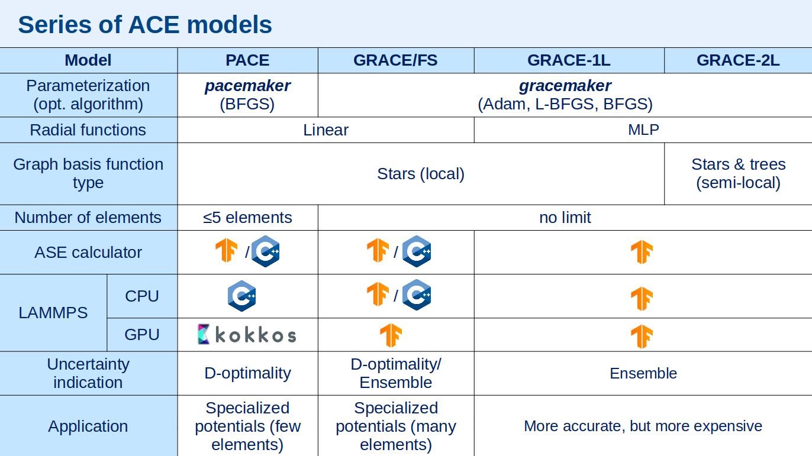

# gracemaker

`gracemaker` is a tool for fitting interatomic potentials in a general non-linear Graph Atomic Cluster Expansion (GRACE) form.

Project GRACEmaker is a heavily modified and in large parts rewritten version of the [PACEmaker](https://pacemaker.readthedocs.io/)
software geared towards support for multi-component materials and graph architectures.


## Series of ACE models




## Features

* Support for multi-component material systems with unlimited number of interacting elements.
* Extension of the local ACE models to also include semi-local interactions (a.k.a. message passing).
* Line of models targeting various performance/complexity regimes and hardware:
    * **GRACE/FS**: Fast, mildly non-linear local model with standalone C++ implementation enabling
    efficient multi-CPU parallelization using MPI in LAMMPS. Intended for large-scale simulations of systems
    containing up to several million atoms.
   
    * **GRACE-1L**: Local, non-linear model with improved accuracy intended to run on GPU.
    Utilizes TensorFlow library to run simulations in LAMMPS or in python and supports multi-GPU parallelization.
    Suitable for modeling both small systems and large-scale simulations of hundreds of thousands of atoms.
  
    * **GRACE-2L**: Semi-local, non-linear model offering state-of-the-art accuracy. 
    Utilizes TensorFlow library to run simulations in LAMMPS or in python.
    Best applied for simulating molecular systems and materials with up to tens of thousand of atoms.

## What's next ?
* !!NEW!! [Video tutorial](https://www.youtube.com/watch?v=rndnkiu9LGE)
* [Installation](gracemaker/install)
* [Quick start](gracemaker/quickstart)
* [Tutorials](gracemaker/tutorials)
* [FAQ](gracemaker/faq)

## Documentation

Please use the navigation bar on the left to explore documentation

## License  

This code and the foundation models are distributed under the [Academic Software License](https://github.com/ICAMS/grace-tensorpotential/blob/master/LICENSE.md).  


## Citation

Please cite following papers if you use GRACEmkaer in your work:

- [Bochkarev, A., Lysogorskiy, Y. and Drautz, R. Graph Atomic Cluster Expansion for Semilocal Interactions beyond Equivariant Message Passing. Phys. Rev. X 14, 021036 (2024)](https://journals.aps.org/prx/abstract/10.1103/PhysRevX.14.021036)


<details>
<summary>BibTeX (click to expand)</summary>

```bibtex
@article{PhysRevX.14.021036,
  title = {Graph Atomic Cluster Expansion for Semilocal Interactions beyond Equivariant Message Passing},
  author = {Bochkarev, Anton and Lysogorskiy, Yury and Drautz, Ralf},
  journal = {Phys. Rev. X},
  volume = {14},
  issue = {2},
  pages = {021036},
  numpages = {28},
  year = {2024},
  month = {Jun},
  publisher = {American Physical Society},
  doi = {10.1103/PhysRevX.14.021036},
  url = {https://link.aps.org/doi/10.1103/PhysRevX.14.021036}
}

```
</details>
